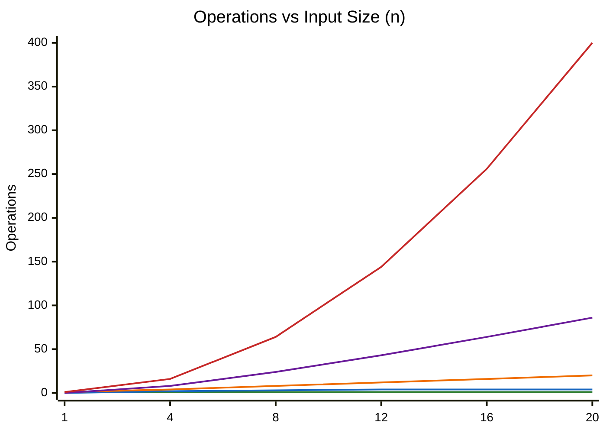
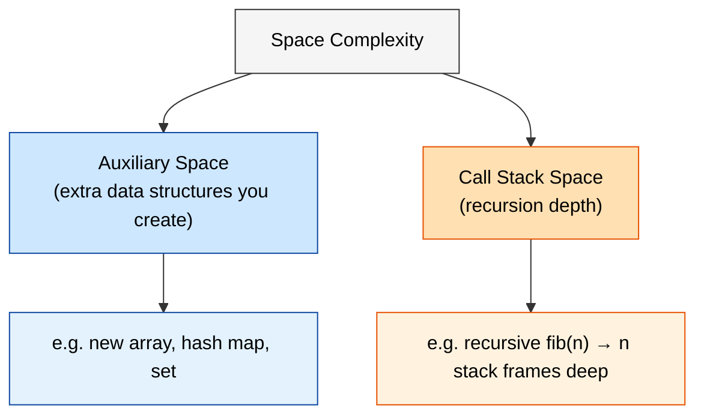
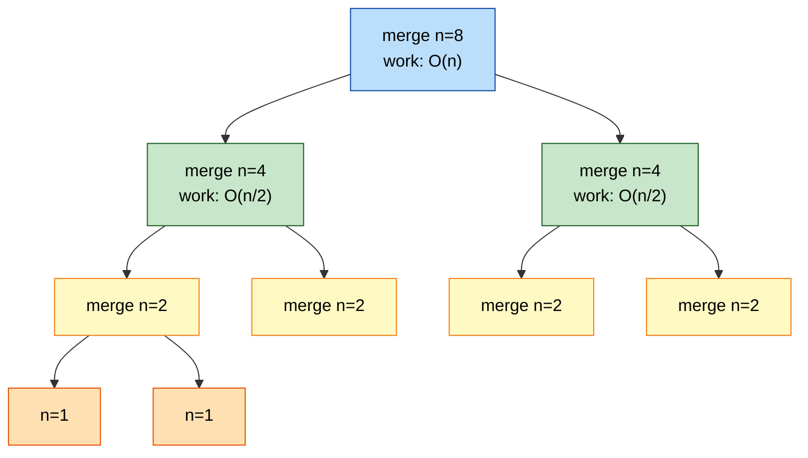
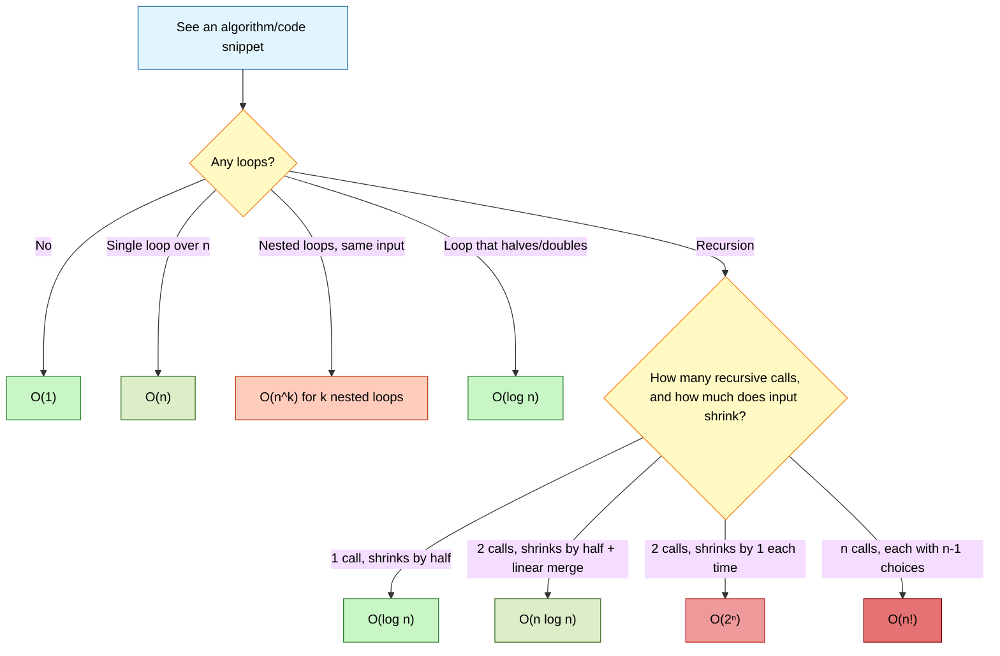

# Big-O Notation — The Complete Deep-Dive & Interview Cheat Sheet

> A reusable reference for Time Complexity (TC), Space Complexity (SC), and everything related to Big-O.
> Code examples use **pseudocode** so the logic applies regardless of language.

---

## Table of Contents

1. [ELI5: What Is Big-O?](#1-eli5-what-is-big-o)
2. [Why Big-O Exists](#2-why-big-o-exists)
3. [The Formal Definition](#3-the-formal-definition)
4. [Big-O vs Big-Omega vs Big-Theta](#4-big-o-vs-big-omega-vs-big-theta)
5. [The Growth Rate Hierarchy](#5-the-growth-rate-hierarchy)
6. [The 5 Golden Rules for Calculating Big-O](#6-the-5-golden-rules-for-calculating-big-o)
7. [Time Complexity — Pattern by Pattern](#7-time-complexity--pattern-by-pattern)
8. [Space Complexity Explained](#8-space-complexity-explained)
9. [Recursion & The Recurrence Relation Trick](#9-recursion--the-recurrence-relation-trick)
10. [Master Theorem — Quick Reference](#10-master-theorem--quick-reference)
11. [Data Structures Complexity Cheat Sheet](#11-data-structures-complexity-cheat-sheet)
12. [Sorting Algorithms Cheat Sheet](#12-sorting-algorithms-cheat-sheet)
13. [Searching Algorithms Cheat Sheet](#13-searching-algorithms-cheat-sheet)
14. [Interview Speed-Reading: Spot the Complexity in 5 Seconds](#14-interview-speed-reading-spot-the-complexity-in-5-seconds)
15. [Common Traps & Gotchas](#15-common-traps--gotchas)
16. [One-Page Ultimate Cheat Sheet](#16-one-page-ultimate-cheat-sheet)

---

## 1. ELI5: What Is Big-O?

Imagine you have to find your friend's name in a phone book.

- **Method A**: You flip through every single page, one by one, checking every name. If the book has 1,000 pages, worst case you check 1,000 pages.
- **Method B**: You use the fact that names are alphabetically sorted, jump to the middle, and cut your search area in half every time. For 1,000 pages, you only need about 10 checks.

Big-O is just a **label** we give to describe how the "amount of work" grows as the "amount of stuff" (input size, usually called `n`) grows.

- Method A is called **O(n)** — work grows *in a straight line* with the number of pages.
- Method B is called **O(log n)** — work grows *very slowly*, even for huge books.

Big-O doesn't tell you the *exact* number of seconds your code takes (that depends on your CPU, runtime, etc). It tells you the **shape of the growth curve** — what happens as `n` gets huge.

---

## 2. Why Big-O Exists

Two engineers write two different functions that both solve the same problem. How do you compare them **without running them** on a specific machine?

You can't use "seconds" — a supercomputer and a laptop give different numbers for the *same* code. What you *can* compare, independent of hardware, is: **"How does the number of operations scale as input size increases?"**

That question has one universal answer per algorithm, and that answer is its Big-O.

**Two things Big-O measures:**

| Type | Question it answers |
|---|---|
| **Time Complexity (TC)** | How many operations grow as `n` grows? |
| **Space Complexity (SC)** | How much extra memory is used as `n` grows? |

---

## 3. The Formal Definition

Mathematically:

```
f(n) = O(g(n))
```

means: *there exist positive constants `c` and `n0` such that `f(n) ≤ c · g(n)` for all `n ≥ n0`.*

In plain English: **once `n` is large enough, `g(n)` is an upper bound on `f(n)`, ignoring constant multipliers.**

This is why:
- `2n + 5` → `O(n)` (the `2` and `+5` don't matter at scale)
- `500` → `O(1)` (a constant, no matter how big, is still constant)
- `n² + n` → `O(n²)` (the `n²` term dominates and drowns out `n` as `n → ∞`)

---

## 4. Big-O vs Big-Omega vs Big-Theta

Interviewers love asking "isn't Big-O the worst case?" — here's the precise answer:

| Notation | Meaning | Analogy |
|---|---|---|
| **Big-O (O)** | Upper bound — "no worse than this" | The *maximum* time you'd ever wait for pizza delivery |
| **Big-Omega (Ω)** | Lower bound — "no better than this" | The *minimum* time delivery could ever take |
| **Big-Theta (Θ)** | Tight bound — "exactly this, both bounds match" | The *average/guaranteed* delivery time band |

**Important nuance:** Big-O by itself doesn't mean "worst case." Big-O is a bound that can be applied to best, worst, or average case analysis. But colloquially — and in 95% of interviews — "Big-O" is used to mean **the upper bound of the worst case**, because that's the most useful guarantee for engineering decisions. When people say "linear search is O(n)," they mean *worst case* is O(n) (element not found or is last).

---

## 5. The Growth Rate Hierarchy

From best to worst, here's how complexity classes scale — this ordering is worth memorizing cold:

```mermaid
%%{init: {"theme": "base", "themeVariables": {"primaryTextColor": "#000000", "textColor": "#000000", "lineColor": "#333333", "fontSize": "16px"}}}%%
graph LR
    A["O(1)<br/>Constant"] --> B["O(log n)<br/>Logarithmic"]
    B --> C["O(n)<br/>Linear"]
    C --> D["O(n log n)<br/>Linearithmic"]
    D --> E["O(n²)<br/>Quadratic"]
    E --> F["O(n³)<br/>Cubic"]
    F --> G["O(2ⁿ)<br/>Exponential"]
    G --> H["O(n!)<br/>Factorial"]

    style A fill:#c8f7c5,stroke:#2e7d32,color:#000000
    style B fill:#d9f2d0,stroke:#2e7d32,color:#000000
    style C fill:#fff2b2,stroke:#a6820a,color:#000000
    style D fill:#ffe082,stroke:#a6820a,color:#000000
    style E fill:#ffcc80,stroke:#c96a00,color:#000000
    style F fill:#ffab91,stroke:#c94100,color:#000000
    style G fill:#ef9a9a,stroke:#b71c1c,color:#000000
    style H fill:#e57373,stroke:#7f0000,color:#000000
```



### Visualizing how fast each one grows (n = 1 to 20)



**What to notice:** by `n = 20`, `O(n²)` already needs 400 operations while `O(n)` needs only 20 and `O(log n)` needs just 4. This gap explodes exponentially larger as `n` grows into the millions — which is exactly why interviewers care so much about this.

| n | O(1) | O(log n) | O(n) | O(n log n) | O(n²) | O(2ⁿ) |
|---|---|---|---|---|---|---|
| 10 | 1 | ~3 | 10 | ~33 | 100 | 1,024 |
| 100 | 1 | ~7 | 100 | ~664 | 10,000 | 1.27 × 10³⁰ |
| 1,000 | 1 | ~10 | 1,000 | ~9,966 | 1,000,000 | astronomically large |

---

## 6. The 5 Golden Rules for Calculating Big-O

### Rule 1 — Drop Constants
```
function example(list):
    print(list[0])       # O(1)
    print(list[0])       # O(1)
    print(list[0])       # O(1)
# Total: O(3) → simplifies to O(1)
```
Big-O cares about the **trend**, not exact counts. `O(3)`, `O(100)`, `O(1)` are all the same class.

### Rule 2 — Drop Non-Dominant Terms
```
function example(list):
    for i in list:               # O(n)
        print(i)
    for i in list:                # O(n) outer
        for j in list:            #  × O(n) inner
            print(i, j)
# Total: O(n + n²) → simplifies to O(n²)
```
As `n → ∞`, the `n²` term makes `n` irrelevant.

### Rule 3 — Different Inputs Get Different Variables
```
function example(listA, listB):
    for a in listA: print(a)      # O(a)
    for b in listB: print(b)      # O(b)
# Total: O(a + b) — NOT O(n). Never collapse unrelated inputs into one variable.
```
This is a **very common interview trap**. If two lists are unrelated in size, keep them as separate variables.

### Rule 4 — Nested Loops on the Same Input Multiply
```
function example(list):
    for i in list:                # n
        for j in list:             # × n
            print(i, j)
# O(n) × O(n) = O(n²)
```

### Rule 5 — Sequential Operations Add
```
function example(list):
    doSomethingLinear(list)       # O(n)
    doSomethingQuadratic(list)    # O(n²)
# O(n) + O(n²) → simplifies to O(n²) by Rule 2
```

---

## 7. Time Complexity — Pattern by Pattern

### O(1) — Constant Time
Work is independent of input size.
```
function getFirst(list):
    return list[0]    # always 1 step, regardless of list size
```

### O(log n) — Logarithmic Time
Input is **cut in half (or by a constant factor)** each step. Binary search is the canonical example.
```
function binarySearch(list, target):
    low = 0
    high = length(list) - 1
    while low <= high:
        mid = floor((low + high) / 2)
        if list[mid] == target:
            return mid
        else if list[mid] < target:
            low = mid + 1
        else:
            high = mid - 1
    return -1
```
**Signal to look for:** the search space shrinks by a fraction (usually ½) every iteration.

### O(n) — Linear Time
One pass through the input.
```
function findMax(list):
    max = -infinity
    for num in list:
        if num > max:
            max = num
    return max
```

### O(n log n) — Linearithmic Time
A linear operation repeated `log n` times — the hallmark of efficient **divide-and-conquer sorting** (merge sort, quicksort average case, heapsort).
```
function mergeSort(list):
    if length(list) <= 1:
        return list
    mid = floor(length(list) / 2)
    left = mergeSort(list[0 : mid])      # splits: log n levels
    right = mergeSort(list[mid : end])
    return merge(left, right)            # merges: O(n) work per level
```

### O(n²) — Quadratic Time
Nested loops over the same input — comparing every element to every other element.
```
function hasDuplicates(list):
    for i from 0 to length(list) - 1:
        for j from i + 1 to length(list) - 1:
            if list[i] == list[j]:
                return true
    return false
```

### O(2ⁿ) — Exponential Time
Each input element **doubles** the number of recursive calls — classic unoptimized recursion (e.g. naive Fibonacci, generating all subsets).
```
function fib(n):
    if n <= 1:
        return n
    return fib(n - 1) + fib(n - 2)    # 2 recursive calls per call
```

### O(n!) — Factorial Time
Generating all permutations of a set.
```
function permute(list, current):
    if length(list) == 0:
        print(current)
    for i from 0 to length(list) - 1:
        rest = list without index i
        permute(rest, current + [list[i]])
```

---

## 8. Space Complexity Explained

Space Complexity (SC) measures **extra memory** your algorithm uses relative to input size — NOT counting the input itself (unless you're told to count it).

**Two buckets that count toward SC:**
1. **Auxiliary space** — new variables, arrays, objects, hash maps you create.
2. **Call stack space** — every recursive call adds a frame to the call stack until it returns.



### Examples

```
# O(1) space — only a few fixed variables, no growth with n
function sum(list):
    total = 0
    for num in list:
        total += num
    return total
```

```
# O(n) space — creates a new list proportional to input
function double(list):
    result = []
    for num in list:
        result.append(num * 2)
    return result
```

```
# O(n) space — even though no new list is created,
# the CALL STACK grows one frame per recursive call
function factorial(n):
    if n <= 1:
        return 1
    return n * factorial(n - 1)    # n frames on the call stack at max depth
```

**Interview tip:** If asked "what's the space complexity of this recursive function?", always account for stack depth, not just declared variables. This is the #1 space-complexity trap.

---

## 9. Recursion & The Recurrence Relation Trick

For recursive functions, the fast way to derive Time Complexity is to write a **recurrence relation** — an equation describing the cost of a call in terms of its subcalls — then solve it.

### Step-by-step method

1. Identify **how many subcalls** are made, and **how much smaller** the input gets each time.
2. Identify the **work done outside the recursive calls** (merging, looping, etc).
3. Write it as: `T(n) = [number of subcalls] · T(n / [divisor]) + [extra work per call]`
4. Visualize as a **recursion tree** and sum the work per level.

### Example: Merge Sort



Recurrence: `T(n) = 2T(n/2) + O(n)`
- The tree has `log n` levels (each level halves the input).
- Each level does `O(n)` total work (splitting/merging across all nodes at that level sums to `n`).
- Total: `O(n) × O(log n) = O(n log n)`.

### Example: Naive Fibonacci

Recurrence: `T(n) = T(n-1) + T(n-2) + O(1)`

Each call spawns 2 more calls → the tree **doubles in width** at every level → `O(2ⁿ)`.

**Fix with memoization** (store previously computed results):
```
function fibMemo(n, memo):
    if n in memo:
        return memo[n]
    if n <= 1:
        return n
    memo[n] = fibMemo(n - 1, memo) + fibMemo(n - 2, memo)
    return memo[n]
# TC: O(n)  — each subproblem solved only once
# SC: O(n)  — memo storage + call stack depth
```
This "memoization collapses exponential trees into linear ones" pattern is one of the highest-leverage things to recognize in interviews.

---

## 10. Master Theorem — Quick Reference

For recurrences of the form `T(n) = a·T(n/b) + O(nᵈ)`:

| Compare | Condition | Result |
|---|---|---|
| `d < log_b(a)` | leaves dominate | `O(n^(log_b a))` |
| `d = log_b(a)` | balanced | `O(nᵈ log n)` |
| `d > log_b(a)` | root dominates | `O(nᵈ)` |

**Quick worked examples:**

| Algorithm | Recurrence | a | b | d | Result |
|---|---|---|---|---|---|
| Binary Search | `T(n) = T(n/2) + O(1)` | 1 | 2 | 0 | `O(log n)` |
| Merge Sort | `T(n) = 2T(n/2) + O(n)` | 2 | 2 | 1 | `O(n log n)` |
| Naive matrix multiply (divide-conquer, 8 subproblems) | `T(n) = 8T(n/2) + O(n²)` | 8 | 2 | 2 | `O(n³)` |
| Strassen's matrix multiply | `T(n) = 7T(n/2) + O(n²)` | 7 | 2 | 2 | `O(n^2.81)` |

You don't need to memorize the theorem's proof for interviews — just recognize the recurrence shape and plug into this table.

---

## 11. Data Structures Complexity Cheat Sheet

| Data Structure | Access | Search | Insert | Delete | Space |
|---|---|---|---|---|---|
| Array | O(1) | O(n) | O(n)* | O(n)* | O(n) |
| Dynamic Array | O(1) | O(n) | O(1) amortized (end) / O(n) (start/mid) | O(1) (end) / O(n) (start/mid) | O(n) |
| Linked List (singly) | O(n) | O(n) | O(1) (at known node) | O(1) (at known node) | O(n) |
| Doubly Linked List | O(n) | O(n) | O(1) | O(1) | O(n) |
| Stack | O(n) | O(n) | O(1) | O(1) | O(n) |
| Queue | O(n) | O(n) | O(1) | O(1) | O(n) |
| Hash Map | O(n/a)** | O(1) avg / O(n) worst | O(1) avg / O(n) worst | O(1) avg / O(n) worst | O(n) |
| Hash Set | N/A | O(1) avg / O(n) worst | O(1) avg / O(n) worst | O(1) avg / O(n) worst | O(n) |
| Binary Search Tree (balanced) | O(log n) | O(log n) | O(log n) | O(log n) | O(n) |
| Binary Search Tree (unbalanced worst case) | O(n) | O(n) | O(n) | O(n) | O(n) |
| Heap (Binary Min/Max) | O(1) top | O(n) | O(log n) | O(log n) (root) | O(n) |
| Trie | O(k)*** | O(k)*** | O(k)*** | O(k)*** | O(n·k) |
| Graph (Adjacency List) | — | O(V + E) traversal | O(1) | O(E) | O(V + E) |
| Graph (Adjacency Matrix) | O(1) edge check | O(V²) traversal | O(1) | O(1) | O(V²) |

`*` Array insert/delete at arbitrary index requires shifting elements → O(n). At the end, it's O(1) amortized.
`**` Hash maps don't support ordered "access by index" — this cell reflects worst-case scan.
`***` `k` = length of the string/key being inserted or searched, not `n`.

**Why hash maps are "O(1) average, O(n) worst":** in the average case, a good hash function distributes keys evenly across buckets, giving constant-time lookup. In the rare worst case (many keys hash-collide into the same bucket), lookup degrades to scanning a list — O(n).

---

## 12. Sorting Algorithms Cheat Sheet

| Algorithm | Best | Average | Worst | Space | Stable? |
|---|---|---|---|---|---|
| Bubble Sort | O(n) | O(n²) | O(n²) | O(1) | Yes |
| Selection Sort | O(n²) | O(n²) | O(n²) | O(1) | No |
| Insertion Sort | O(n) | O(n²) | O(n²) | O(1) | Yes |
| Merge Sort | O(n log n) | O(n log n) | O(n log n) | O(n) | Yes |
| Quick Sort | O(n log n) | O(n log n) | O(n²) | O(log n) | No |
| Heap Sort | O(n log n) | O(n log n) | O(n log n) | O(1) | No |
| Counting Sort | O(n + k) | O(n + k) | O(n + k) | O(n + k) | Yes |
| Radix Sort | O(nk) | O(nk) | O(nk) | O(n + k) | Yes |

**Why Quick Sort's worst case is O(n²):** if the pivot chosen is always the smallest or largest element (e.g. already-sorted input with a naive "always pick first element" pivot strategy), each partition only shrinks the problem by 1 element instead of splitting it in half — degrading into `n` nested passes.

**Stable vs Unstable:** a *stable* sort preserves the relative order of equal elements. Matters when sorting objects by one field but wanting ties to keep their original order (e.g. sorting students by grade, then wanting same-grade students to stay in original name order).

---

## 13. Searching Algorithms Cheat Sheet

| Algorithm | Best | Average | Worst | Space | Precondition |
|---|---|---|---|---|---|
| Linear Search | O(1) | O(n) | O(n) | O(1) | None |
| Binary Search | O(1) | O(log n) | O(log n) | O(1) iterative / O(log n) recursive | Sorted array |
| BFS (graph/tree) | O(V + E) | O(V + E) | O(V + E) | O(V) | None |
| DFS (graph/tree) | O(V + E) | O(V + E) | O(V + E) | O(V) (call stack) | None |

---

## 14. Interview Speed-Reading: Spot the Complexity in 5 Seconds

This is the pattern-recognition table experienced engineers use to eyeball complexity almost instantly.

| Code shape | Complexity | Why |
|---|---|---|
| Single loop over `n` | O(n) | One pass |
| Loop inside a loop (same array) | O(n²) | Nested iteration |
| Loop that halves each time | O(log n) | Shrinking search space |
| Loop over `n`, containing a loop that halves | O(n log n) | Linear × logarithmic |
| Two separate, non-nested loops over `n` | O(n) | Sequential → add, not multiply |
| Two loops over two *different* inputs | O(a + b) | Never collapse to O(n) |
| Recursion with 1 call, input shrinks by half | O(log n) | e.g. binary search |
| Recursion with 2 calls, input shrinks by half + linear merge work | O(n log n) | e.g. merge sort |
| Recursion with 2 calls, input shrinks by 1 each time | O(2ⁿ) | e.g. naive Fibonacci |
| Recursion generating all subsets | O(2ⁿ) | Each element: include or exclude |
| Recursion generating all permutations | O(n!) | Each position has n, n-1, n-2... choices |
| Sliding window / two pointers | O(n) | Each pointer moves forward at most n times total |
| Hash map used to avoid a nested loop | Often drops O(n²) → O(n) | Trades space for time |
| Sorting used as a first step | Often at least O(n log n) | Sorting sets the floor |

**The #1 interview move:** if you catch yourself writing a nested loop to check "does this exist elsewhere in the list," pause and ask *"could a hash map turn this into a single pass?"* — this single habit resolves a huge fraction of "optimize this" interview follow-ups.

---

## 15. Common Traps & Gotchas

1. **"O(n) always beats O(n²)"** — false for small `n`. Constants matter at small scale (an O(n²) algorithm with tiny constants can beat O(n log n) with huge constants, for small inputs). Big-O only describes behavior as `n → ∞`.

2. **String concatenation in a loop.** In many languages, repeatedly appending a character to a string inside a loop of length `n` can be O(n²) total, because each concatenation may copy the whole string. Building a list of characters and joining once at the end guarantees O(n).

3. **A "contains" check inside a loop.** Looks like O(n) but is secretly O(n²), because each "contains" check is itself an O(n) scan.
```
# Looks O(n), is actually O(n²)
for item in listA:
    if item in listB:      # O(n) search, inside O(n) loop
        # ...
```

4. **Amortized vs worst-case.** A dynamic array's "append to end" is often described as O(1), but it's *amortized* O(1) — occasionally the underlying array must be resized and copied (O(n)), but this happens rarely enough that it averages out to O(1) per call over many calls.

5. **Forgetting the call stack in recursive space complexity.** As shown in Section 8 — recursion depth counts as space even with zero extra variables declared.

6. **Confusing "average case" with "Big-O."** Quicksort is "O(n log n)" in casual conversation but its **worst case** is O(n²); always clarify which case you mean, especially with hash maps and quicksort.

7. **Treating all "O(1)" operations as equally fast in wall-clock time.** Big-O ignores constants — an O(1) operation that does 1,000 fixed steps is still "O(1)," but will be slower in real seconds than a different O(1) operation doing 2 steps.

---

## 16. One-Page Ultimate Cheat Sheet



### The Checklist to Answer "What's the Time/Space Complexity?" in an Interview

1. **Identify all inputs.** Are there one or multiple independent inputs (arrays, strings)? Assign each its own variable (`n`, `m`, `a`, `b`...).
2. **Scan for loops.** Count nesting depth over the *same* input → multiply. Loops over *different* inputs, one after another → add.
3. **Scan for recursion.** Write the recurrence `T(n) = a·T(n/b) + f(n)`. Use the Master Theorem table (Section 10) or draw the recursion tree.
4. **Check for hidden costs.** Built-in operations like "contains," "sort," "slice," string concatenation — each has its own complexity that stacks on top of your loop.
5. **Apply the Golden Rules** (Section 6): drop constants, drop non-dominant terms, keep independent inputs separate.
6. **For space:** count (a) new data structures created (arrays, maps, sets) and (b) maximum call stack depth for recursive solutions.
7. **State best/average/worst if they differ** (especially for hash maps and quicksort) — this shows interview maturity.
8. **Sanity check against the hierarchy** (Section 5) — does your answer make sense given what the code is actually doing?

### Quick Symbol Reference

| Symbol | Meaning |
|---|---|
| `n` | size of the primary input |
| `V`, `E` | vertices, edges (graph problems) |
| `k` | length of a string/key, or range of values (e.g. counting sort) |
| `a, b` | sizes of two independent inputs |
| `log n` | assumed base 2 unless stated otherwise, in CS contexts |

---

*End of reference. Keep this file as a living document — extend the Data Structures and Sorting tables as you encounter new structures (e.g. AVL trees, B-trees, Fenwick trees, Union-Find) in your DSA practice.*
